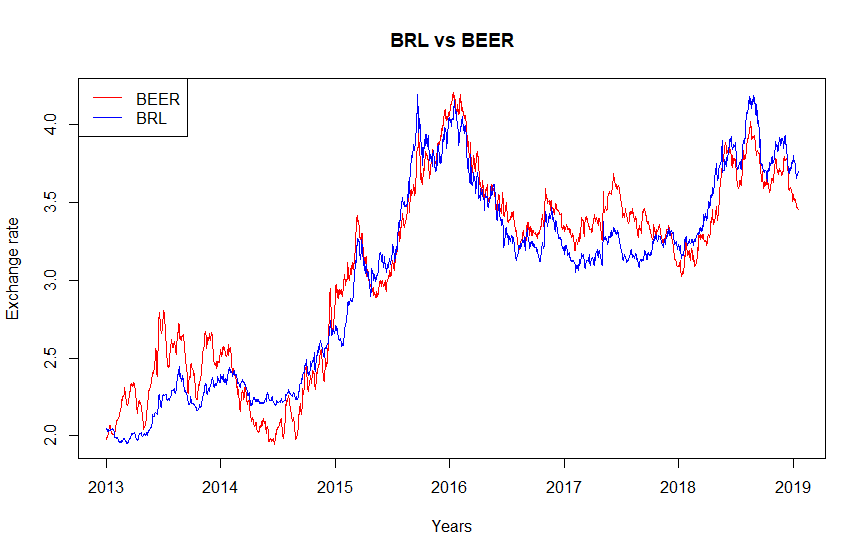

 
 

In this project, I aimed to estimate the brazilian Behavorial Equilibrium Exchange Rate (BEER).  

 

The BEER approach is based on an econometric analysis of the behavior of the real effective exchange rate.
Within this framework, the exchange rate is explained by transitory factors that have affect the short run,
economic fundamentals with effects over the medium and long run, and random disturbances. 

 

It can be estimated using a VECM model after estimating the Johansen test.

 

For the brazilian case, the BEER model was the following:  

 

$log(et) = +1.06*log(CDS) -1.26*log(CRB) +1.07*log(DXY) -0.07*[log(1+i) - log(1+i*)]$  

 

where:  

**CDS** - credit default swap, which it's used to measure risk appetite  

**CRB** - commodity price index as a proxy for terms of trade  

**DXY** - index for measuring the US dollar against a basket of major currencies  

**i** - brazilian 1-year interest rate  

**i* ** - US 1-year interest rate  
 
The signs of the parameters make sense as a higher CDS depreciates the currency, indicating less appetite for risk, while better terms of trade (higher CRB) appreciate the currency. A stronger dollar against other major currencies also depreciates the Brazilian currency, and a larger interest rate differential appreciates the currency. 
 
 

Plotting the graph, we get:  

Finally, we can plot the impulse response function.

 

The interpretation is as follows: a shock of 1 standard deviation is given to one of the variables, which
will affect the other throughout the remaining periods. Here, all of the explanatory variables are given a shock
on the exchange rate for a 20-day horizon. The magnitude of the shock seems to be aligned with what we expected
for each one of the variables. The only one that did not show any significance was the interest rate 
differential, as we can see that zero is within the confidence interval.    

   

**REFERENCES:**  

**- BNDES. Taxa de câmbio no Brasil: o que dizem os fundamentos?. Nota informativa APE/DAE, 28 de março de 2016.**

**- CLARK, Peter B.; MACDONALD, Ronald (1998). Exchange rates and economic fundamentals: a methodological comparison of BEERs and FEERs. IMF Working Paper, No 98/67, maio de 1998.**

**- SCHWARTSMAN,Alexandre; PINHEIRO,Tatiana (2010). Slip Slidin’ Away. Santander Economics Research.**

   
   

